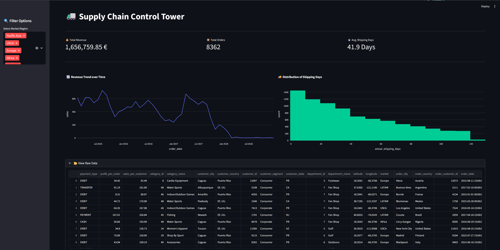

# 🚚 Supply Chain Control Tower (Dashboard)



> **Interactive Analytics:** A web-based dashboard to visualize logistics performance, delivery times, and revenue trends.
> **Status:** ✅ Active (v1.0)

## 🎯 The Goal
Raw data in CSV files is hard to interpret. This project transforms the cleaned supply chain dataset into an **interactive Streamlit Web Application**.
It empowers logistics managers to answer critical questions in seconds:
* *"How is our revenue developing over time?"*
* *"Which regions have the longest shipping delays?"*
* *"Are we meeting our delivery KPIs?"*

## ⚡ Key Features
* **Real-Time Filtering:** Sidebar controls to slice data by market/region instantly.
* **Smart Caching:** Uses `@st.cache_data` for high-performance data loading.
* **Interactive Visualizations:**
    * 📈 **Revenue Trend:** Zoomable line charts (Plotly) to analyze sales over time.
    * 🚚 **Lead Time Analysis:** Histograms showing the distribution of actual shipping days.
* **KPI "Big Numbers":** Live calculation of Total Sales, Order Count, and Average Lead Time based on active filters.

## 🛠️ Tech Stack
* **Python 3.10+**
* **Streamlit:** For rapid web app development (Frontend + Backend).
* **Plotly Express:** For interactive, responsive charts.
* **Pandas:** For in-memory data manipulation and filtering.

## 🚀 How to Run Locally

1.  Navigate to the dashboard folder:
    ```bash
    cd dashboard
    ```
2.  Install dependencies:
    ```bash
    pip install -r requirements.txt
    ```
3.  Launch the application:
    ```bash
    streamlit run app.py
    ```
4.  The dashboard will open automatically in your browser (usually at `http://localhost:8501`).

## 📂 Project Structure
```text
dashboard/
├── app.py                      # Main application logic
├── requirements.txt            # Python dependencies
└── cleaned_supply_chain_data.csv # The dataset (Output from Project B)
```

## 📊 Business Scenario & Insights

> **Scenario:** The Head of Logistics asked for a review of Q1 Performance and an explanation for the corrected revenue figures.

### 1. The "Revenue Drop" Explained
After cleaning the data, the Total Revenue appears to decrease by **~300,000 €**.
* **Cause:** The raw dataset included "Zombie Shipments" (delivery times > 4 years) and logical errors (negative shipping days).
* **Insight:** The previous revenue figures were inflated by invalid orders. The current figure represents the **true, audit-proof financial status**.

### 2. Lead Time Reality Check
* **Metric:** Average Shipping Time is **41.9 Days**.
* **Observation:** The histogram shows a clean distribution. Previously, extreme outliers distorted this KPI.
* **Action:** Use 41.9 days as the reliable baseline for future forecasting.

### 3. Conclusion
The dashboard proves that **Data Quality** directly impacts Business Strategy. We are now optimizing based on reality, not on noise.
